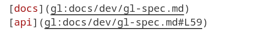
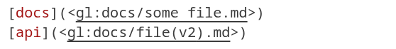
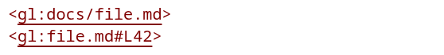
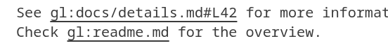
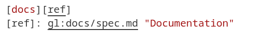
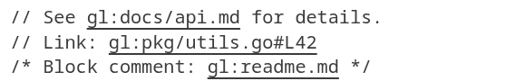
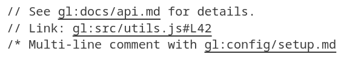
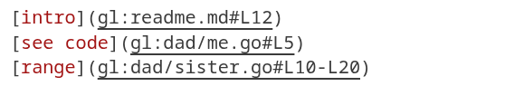

# gl: git links VS Code Extension

Visual Studio Code extension for `gl:` git link syntax (specification version 25.10.171). For the gl-git-links project and specification, see [github.com/mj41/gl-git-links](https://github.com/mj41/gl-git-links).

## VS Code Marketplace

Install [mj41.gl-git-links](https://marketplace.visualstudio.com/items?itemName=mj41.gl-git-links) from the Visual Studio Marketplace, published by [mj41](https://marketplace.visualstudio.com/publishers/mj41).

## Features

- **Clickable Links**: Click valid `gl:` links to navigate to files within your git repository.
- **Quick Fixes**: Apply lightbulb fixes to normalize link syntax or scaffold missing targets.
- **Line Number Support**: Jump directly to specific lines with `#L123` syntax.
- **Line Range Support**: Navigate to line ranges with `#L123-L456` syntax.
- **Relative Paths**: Support for relative paths (`./sister.go`) and parent directories (`./../uncle/cousin.py`).
- **Diagnostics**: Real-time validation of `gl:` links with helpful warnings.
- **Hover Information**: Hover over `gl:` links to see a `Git Link` tooltip with the resolved path and line (or range), plus status/expected/found details when something is wrong.
- **Markdown Preview**: Clickable links work in Markdown preview panes.
- **Extended Autolinks**: Automatic recognition in plain text following GFM-style autolinks extension rules.

## Quick Start

1. Open a git repository in VS Code.
2. Add `gl:` links in any file, including Markdown, source comments, or plain text.
3. Click a link (or `Cmd/Ctrl+Click`) to jump to the referenced file and line.

## Link Syntax

### Basic Syntax

```
gl:readme.md                    - Repository root relative
gl:readme.md#L12                - With line number
gl:file.go#L123-L456            - With line range
gl:./sister.go#L7               - Current directory relative
gl:./../uncle/cousin.py#L10     - Parent directory relative
```

### Markdown Links

**Inline links:**

 

**With special characters (wrapped in `<...>`):**

 

**Autolinks:**

 

**Extended autolinks (GFM-style):**

 

**Reference links:**

 

### Plain Text and Comments

The extension recognizes `gl:` links in plain text files and programming language comments:

**Go:**

 

**Python:**

 

**JavaScript:**

 

## Example Repository Structure

```
repoA/
    ├── dad/
    │   ├── me.go
    │   └── sister.go
    ├── uncle/
    │   └── cousin.py
    └── readme.md
```

Links from `dad/me.go`:
- `gl:readme.md#L12` - Links to repository root file
- `gl:./sister.go#L7` - Links to sibling file
- `gl:./../uncle/cousin.py#L10` - Links to cousin file

Markdown links from `readme.md`:

 

## Path Resolution

All paths are resolved relative to the directory containing the `.git` folder (repository root).

**Absolute paths** start from repository root:
```
gl:readme.md
gl:docs/api/spec.md
gl:src/main.go
```

**Relative paths** start from the current file's directory and must begin with `./`:
```
gl:./sister.go           (same directory)
gl:./../uncle/cousin.py  (parent directory, then subdirectory)
gl:./../../other.md      (two levels up)
```
Bare `gl:../foo` links are invalid per the specification; always include the leading `./` when traversing ancestors.

## Line Numbers and Ranges

Line numbers use the `#L` prefix with uppercase `L` (case-sensitive):

**Single line:**
```
gl:file.go#L42
gl:./relative.md#L123
```

**Line range:**
```
gl:file.go#L123-L456
```

Line ranges follow GitHub's syntax pattern. Line numbers are 1-indexed. Invalid line numbers (beyond file length) will navigate to the last line or show an error.

## Diagnostics & Validation

The extension provides real-time diagnostics for invalid `gl:` links and blocks navigation or preview rewrites until issues are fixed. See [Invalid gl Links](gl:docs/invalid-gl-links.md) for a complete list of validation rules.

### Common Issues Detected

| Issue | Example | Error Message |
|-------|---------|---------------|
| Leading slash | `gl:/path/to/file.md` | "Remove leading slash: use gl:path/to/file.md" |
| Missing file | `gl:docs/missing.md` | "gl: target file 'docs/missing.md' does not exist" |
| Invalid line format | `gl:README.md#123` | "Use #L123 format for line numbers" |
| Lowercase L in line number | `gl:README.md#l123` | "Use uppercase L in line numbers (#L123)" |
| Dots in middle of path | `gl:docs/../README.md` | "Use gl:README.md instead of gl:docs/../README.md" |
| Cross-repo navigation | `gl:./../other-repo/file.md` | "Cross-repo gl: links are not supported" |
| Path traversal outside repo | Paths escaping `.git` parent | "Path resolves outside repository" |

## Quick Fixes

Trigger quick fixes from warnings via:
1. Click the lightbulb icon, or
2. Press `Ctrl+.` (Cmd+. on Mac), or
3. Right-click and select "Quick Fix..."

### Available Quick Fixes

1. **Remove Leading Slash** – Converts `gl:/path/to/file.md` to `gl:path/to/file.md`
2. **Add ./ Prefix** – Rewrites `gl:../file.md` to `gl:./../file.md`
3. **Normalize Path Segments** – Collapses sequences such as `gl:docs/../README.md`
4. **Create Missing File** – Creates the target file (and any missing directories) inside the repository

## Language Support

Works in **all file types**:
- Markdown (`.md`)
- Go (`.go`)
- Python (`.py`)
- JavaScript (`.js`, `.ts`)
- Shell scripts (`.sh`)
- Plain text (`.txt`)
- and more...

## Requirements

- Your project must be in a git repository (contains `.git` folder)
- VS Code 1.80.0 or higher

## Extension Settings

This extension contributes no additional settings. It works automatically when you open a git repository.

## Known Limitations

- Cross-repository links are not supported
- Only works within a single git repository
- Line ranges (`#L123-L456`) are recognized but navigation behavior may vary

## Security

The extension:
- Validates that paths resolve within the repository
- Rejects or sandboxes path traversal attempts (`../../outside-repo`)
- Validates line numbers against file length
- Handles malformed URIs gracefully

## Installation

### From Source

```bash
npm install -g @vscode/vsce
vsce package
code-insiders --install-extension gl-git-links-0.3.3.vsix
```

### From Marketplace

Coming soon – the extension will be published to the VS Code Marketplace.

## Development

### Building from Source

```bash
cd vscode-gl-git-links
npm install
npm run compile
```

### Running Tests

```bash
npm test
```

### Dev Documentation

See [docs/dev/readme.md](docs/dev/readme.md) for development guidelines and architecture overview.

## Changelog

See [CHANGELOG.md](CHANGELOG.md) for a detailed list of changes.

## License

See [LICENSE](LICENSE) file for details.

## Contributing

Issues and pull requests are welcome!

## References

- gl-git-links specification: [github.com/mj41/gl-git-links](https://github.com/mj41/gl-git-links)
- CommonMark Specification v0.31.2: <https://spec.commonmark.org/0.31.2/>
- GitHub Flavored Markdown Specification 0.29-gfm: <https://github.github.com/gfm/>
